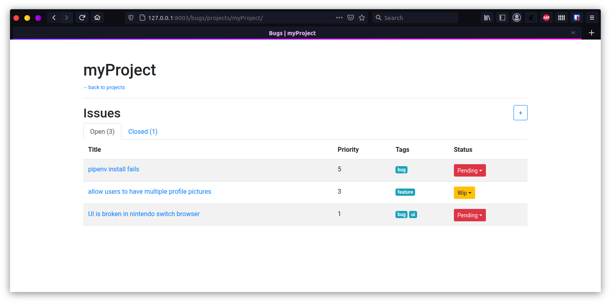
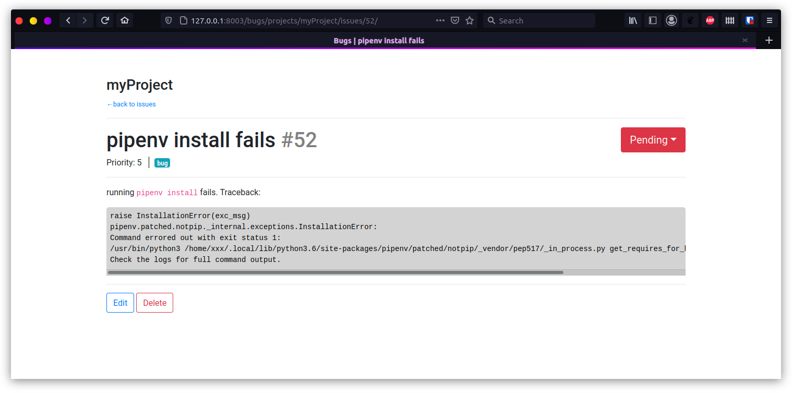

# Bugs

A dead simple local issuetracker for your sideprojects.




**Features**
 - create projects
 - create issues for projects
 - format the description of the issue with markdown
 - mark issues as pending, WIP (work in progress), done or wontfix
 - assign priority to issues
 - assign tags to issues
 - a CLI
 - filter issues by tag

**Features yet to come**
 - users (maybemaybe)


### CLI

```text
$ python bugs_cli.py --help

NAME
    bugs_cli.py - Command Line Interface for BugsClient

SYNOPSIS
    bugs_cli.py COMMAND

DESCRIPTION
    Command Line Interface for BugsClient

COMMANDS
    COMMAND is one of the following:

     create
       create a new project. If no projectname is given, the name of the project will be taken from the environment variable BUGSPROJECT or, if not set, the current directory name.

     ls
       list issues in project. If no projectname is given, the name of the project will be taken from the environment variable BUGSPROJECT or, if not set, the current directory name.

     mark
       set the status for an issue. If no projectname is given, the name of the project will be taken from the environment variable BUGSPROJECT or, if not set, the current directory name.

     projects
       list all projects

     show
       show details of an issue. If no projectname is given, the name of the project will be taken from the environment variable BUGSPROJECT or, if not set, the current directory name.
```

## Installation

Requirements: `python3.8`, `pipenv`

```
git clone https://github.com/davekch/bugs.git
cd bugs
pipenv install
./manage.py migrate
```
In development, run
```
export DJANGO_ENVIRONMENT=development
./manage.py runserver <port>
```
In production, run `./manage.py runserver` to create a config file at `bugtrack/settings/productionsettings.ini`. Edit the section server[allowed] to set the allowed hosts.
